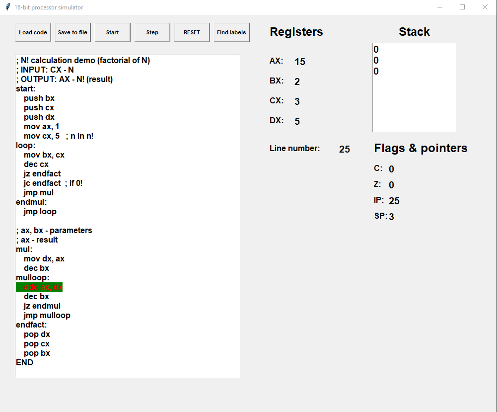

# Simulator of 16-bit CPU

Gui simulator for imaginary 16-bit CPU. 

## Register list
All registers are 16-bit registers which are made of 8-bit registers. So every register has it's low and high part (nibble) which are accessed by using L or H letter (AX = AH and AL).
- AX
- BX
- CX
- DX

## CPU Features
- Stack
- Carry flag
- Zero flag
- Stack pointer
- Instruction pointer

## Assembly
### Instruction set
| Instruction       | Arg 1        | Arg 2 &nbsp; &nbsp; &nbsp; &nbsp; &nbsp; &nbsp; &nbsp; &nbsp; &nbsp;           | Description           |
| -------------     |:----------------: | --------------------: | --------------------: |
| ADD               | REG 1, NUMBER     |    REG 2              | Add argument 1 to argument 2. Save result in argument 2                 |
| SUB               | REG 1, NUMBER     |    REG 2              | Subtract argument 1 from argument 2. Save result in argument 2 |
| MOV               | REG 1, NUMBER     |    REG 2              | Copy given value or value of given register in argument 1 to register in argument 2 |
| PUSH              | REG               |    -                  | Save value of given register on top of the stack |
| POP               | REG               |    -                  | Pop value from to of the stack and save it in given register |
| JMP               | LABEL             |    -                  | Unconditional jump to given label |
| JZ                | LABEL             |    -                  | Jump when zero flag is set. Jump to line described with label |
| JC                | LABEL             |    -                  | Jump when carry flag is set. Jump to line described with label |
| INC               | REG               |    -                  | Increment given register by 1 |
| DEC               | REG               |    -                  | Decrement given register by 1 |
| ORL               | REG 1             |    REG 2              | Logical or between given registers. Result saved in argument 2 |
| ANDL              | REG 1             |    REG 2              | Logical and between given registers. Result saved in argument 2 |
| XORL              | REG 1             |    REG 2              | Logical xor between given registers. Result saved in argument 2 |
| CRL               | REG               |    -                  | Clear given register (set its value to 0) |
| ROR               | REG               |    -                  | Rotate given register right |
| ROL               | REG               |    -                  | Rotate given register left |
| SHR               | REG               |    -                  | Shift right given register by one bit |
| SHL               | REG               |    -                  | Shift left given register by one bit |

There are no address sapce. Labels are names for line numbers and IP points just to the number of the line that is currently executed.

## Simulator features
- Visible processor's guts
- Simple text editor for editing code
- Loading/saving files with programms
- Real-time execution
- Step/debug mode execution
- Reset
- Currently executed line is highlighted

When you add label manually in embedded code editor you need to reset your program. When the program didn't started it's always good to click 'Find labels' button. After doing so you can be confident that parser acknowledged your changes and program will run properly.

## Demos
Directory 'demos' contains simple demonstration programs:
- parser tester
- Fibonacci numbers generator
- factorial numbers calculation
